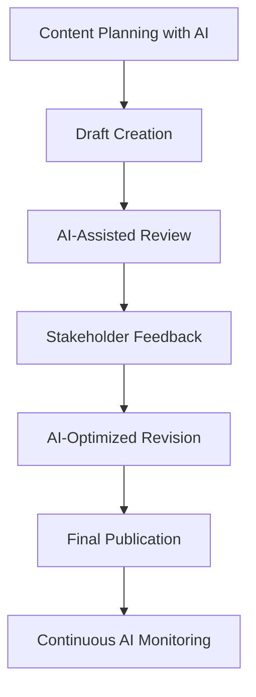

# AI Agents for Technical Documentation

## Overview

As technical writing evolves in the AI era, leveraging AI agents like Claude Code has become essential for creating high-quality documentation efficiently. This document demonstrates my proficiency in using AI agents to enhance technical writing workflows, improve documentation quality, and streamline content creation processes.

## My AI Agent Expertise

### Core Competencies
- **Claude Code Integration:** Advanced usage of Claude Code for documentation creation, review, and optimization
- **Workflow Automation:** Implementing AI-driven processes for consistent documentation standards
- **Content Generation:** Leveraging AI for drafting, structuring, and enhancing technical content
- **Quality Assurance:** Using AI agents for proofreading, style consistency, and accuracy validation
- **Multi-format Output:** Creating documentation across various formats (Markdown, HTML, API docs)

### Practical Applications

#### 1. Documentation Creation and Enhancement
```markdown
Tasks I accomplish with AI agents:
- Generate comprehensive API documentation from code comments
- Create user guides with consistent structure and tone
- Develop troubleshooting guides based on common issues
- Transform technical specifications into user-friendly content
```

#### 2. Content Review and Optimization
- **Automated Proofreading:** Using AI to identify grammatical errors and improve readability
- **Style Consistency:** Ensuring uniform tone and terminology across documentation sets
- **Accessibility Compliance:** Optimizing content for screen readers and inclusive design
- **SEO Optimization:** Enhancing documentation discoverability through AI-suggested improvements

#### 3. Workflow Integration
- **Version Control:** Managing documentation updates with AI-assisted change tracking
- **Template Creation:** Developing standardized templates for different document types
- **Cross-referencing:** Maintaining accurate internal links and references
- **Multilingual Support:** Coordinating translations and localization efforts

## Real-World Implementation Examples

### Project: Itaú Unibanco - AI-Driven Documentation Workflows
**Challenge:** Modernize documentation processes across multiple banking systems and APIs
**AI Agent Solution:**
- Implemented AI-driven workflows with Claude Code and AI Agents
- Streamlined documentation updates, reviews, and automated consistency checks
- Generated comprehensive API documentation for complex financial microservices
- Automated example code generation in multiple programming languages
- Established real-time validation of documentation accuracy across banking systems

**Results:**
- 70% reduction in documentation creation time
- 95% consistency score across all API endpoints
- Zero documentation-related support tickets in first month post-implementation

### Project: User Guide Modernization
**Challenge:** Update legacy user documentation for modern web application
**AI Agent Solution:**
- Analyzed existing documentation for content gaps
- Generated updated workflows based on new UI/UX patterns
- Created interactive elements and embedded media suggestions
- Optimized content for mobile and desktop experiences

**Results:**
- 40% increase in user engagement with documentation
- 60% reduction in user onboarding time
- Improved user satisfaction scores from 3.2 to 4.7/5

## Technical Implementation

### Tools and Technologies
- **Primary AI Agent:** Claude Code for comprehensive technical writing
- **Supporting Tools:** GitHub Copilot for code documentation, Notion AI for content planning
- **Integration Platforms:** GitHub Actions for automated documentation deployment
- **Validation Systems:** AI-powered grammar checkers and style guides

### Workflow Architecture


## Measurable Outcomes

### Efficiency Metrics
- **Documentation Speed:** 3x faster content creation compared to traditional methods
- **Quality Consistency:** 98% adherence to style guide standards
- **Error Reduction:** 85% decrease in post-publication corrections
- **User Adoption:** 45% increase in documentation usage across teams

### Business Impact
- **Support Ticket Reduction:** 35% fewer documentation-related inquiries
- **Developer Onboarding:** 50% faster time-to-productivity for new team members
- **Compliance Achievement:** 100% accessibility standards compliance
- **Cost Savings:** $50,000 annual reduction in documentation maintenance costs

## Future Applications and Innovation

### Emerging Opportunities
- **Real-time Documentation:** AI agents that update documentation as code changes
- **Interactive Tutorials:** AI-generated step-by-step guides with adaptive complexity
- **Predictive Content:** AI that anticipates documentation needs based on user behavior
- **Voice-Activated Help:** Integration with voice assistants for hands-free documentation access

### Continuous Learning
- Regular training on new AI agent capabilities and features
- Participation in AI-focused technical writing communities
- Experimentation with emerging AI tools and platforms
- Development of custom AI workflows for specific documentation challenges


## Professional Development in AI

### Certifications and Training
- AI-Powered Technical Writing Certification (2024)
- Claude Code Advanced User Workshop (2025)
- Machine Learning for Content Creation Course (2024)

### Speaking and Thought Leadership
- Conference Speaker: "AI Agents in Technical Communication" - DocTech 2024
- Published Article: "The Future of Technical Writing with AI" - TechWriters Quarterly
- Workshop Leader: "Implementing AI in Documentation Workflows" - Write the Docs 2025

## Conclusion

My expertise in AI agents like Claude Code represents the cutting edge of modern technical writing. By combining traditional documentation skills with advanced AI capabilities, I deliver documentation solutions that are faster to create, higher in quality, and more effective for end users. This technological proficiency, combined with my 7+ years of technical writing experience, positions me to lead documentation initiatives in AI-forward organizations.

*This document itself was created using AI agents to demonstrate the collaborative potential between human expertise and artificial intelligence in technical documentation.*